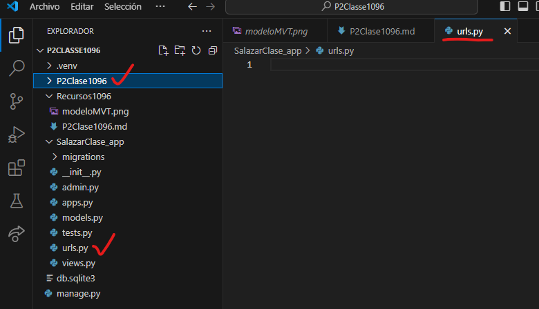
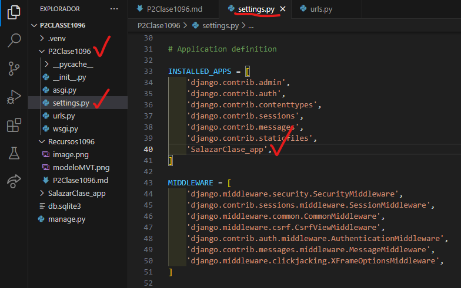
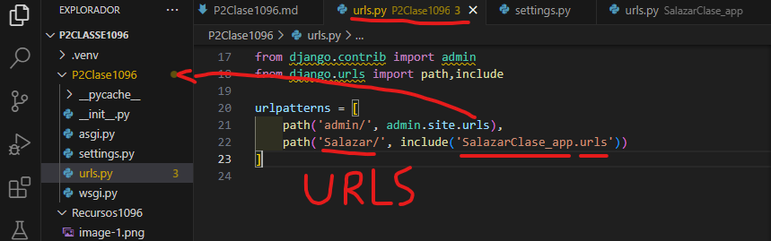
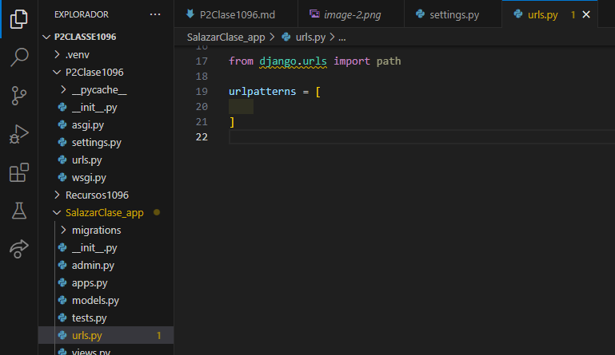
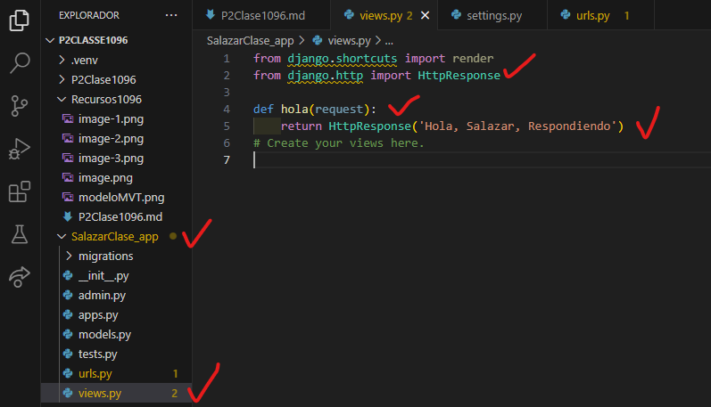
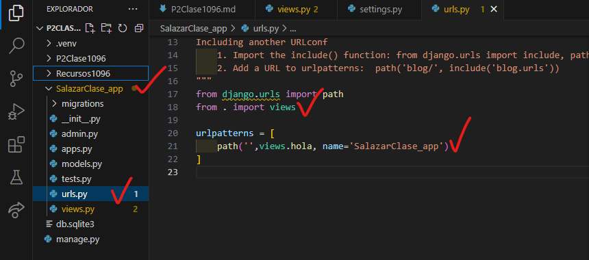

- Crear aplicacion SalazarClase_app

- Comando -->  python manage.py startapp SalazarClase_app

- Creamos el archivo urls.py en SalazarClase_app

- En setting.py de P2Clase1096

- En urls.py de P2Clase1096

- En urls.py de SalazarClase_app

- En views.py en SalazarClase_app

- en urls.py en SalazarClase_app

